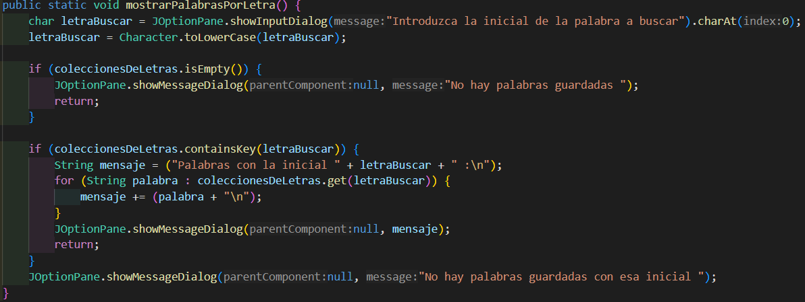

# Clase Diccionario:

En la clase "Diccionario" es donde se encuentra el groso de nuestro programa, es aquí donde encontramos todos los métodos estáticos que usaremos para interactuar con el diccionario, y que será llamados desde la clase ejecutable a petición del usuario, el primer método que encontramos es el siguiente:

En este método, primeramente, solicitamos la palabra que desea añadir el usuario, y se transforma todas las letras en minúscula, se verifica que sea una palabra valida llamando al método estático de la clase validador "palabraAceptable()", en caso de que la palabra sea válida, se continuará, en caso contrario, el propio método mostrará un mensaje indicandolo. 

Si la palabra es valida, se le quitan los espacios que pueda contener y se obtiene su incial, que nos servirá como valor llave para navegar a través de nuestro "Map" hasta encontrar el "HashSet" correspondiente, o en caso de no existir, crearlo.

Si no existe ningún set asociado a este valor clave, se creará un nuevo "HashSet" en el que se añadirá la palabra introducida por el usuario, y acto seguido se vinculará ese set con la key (inicial de la palabra) dentro del "Map" del diccionario.

En caso de que si exista un "Set" asociado a esa inical, se verificaría lo siguiente: Si estuviera vacío, se añadiría la palabra y se mostraría un mensaje indicandolo. Si contubiera la palabra, se mostraría un mensaje indicandolo, por último, si existiera el Set y no contuviera la palabra, se añadirá y mostrará un mensaje indicandolo.

En este método, se comprueba que haya algun conjunto de palabras ya almacenado, en caso negativo se mostrará un mensaje indicando que no hay ninguna palabra almacenada, en caso contrario, se recorrerá, almacenando en cada iteración el valor de la key asociado a cada "Set" almacenado en el "Map" del diccionario, al terminar, se mostrará por pantalla los valores previamente almacenados.

En este método, se solicita la inicial de las palabras que se quieren mostrar. Se mostrará un mensaje concreto si el "Map" está vacío, en caso de no estar vacío, se almacenarán para mostrar posteriormente las palabras que empiecen por es letra. Por último, en caso de que no haya palabras almacenadas que empiecen por esa inicial, se mostrará un mensaje que lo indique.

En este método, se solicita la palabra que se pretende averiguar si está almacenada, en caso de que el "Map", no tenga ningún "Set" almacenado, se mostrará un mensaje que lo indique, por otra parte, si existe un set asociado a esa incial, se verificará que esta palabra este almacenada y se mostrará un mensaje indicando ambas posibilidades (que esté o no almacenada) 

En este método, se solicita la palabra que se desea eliminar, en caso de que el "Map" esté vacío, se indicará mediante un mensaje. En caso de que existe una colección en la que esté almacenada dicha palabra, será eliminada y se mostrará un mensaje que lo indique. En caso contrario, se indicará con un mensaje.