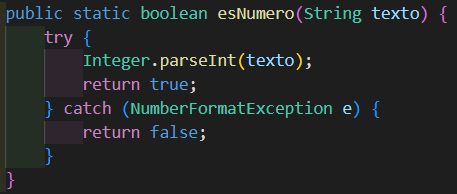
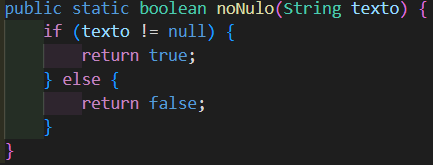
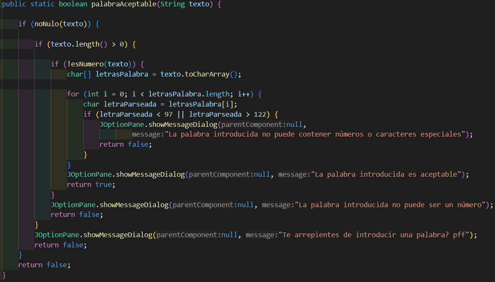

# Clase Validador:

En la clase "Validador" encontramos tres métodos estáticos a los que se llaman desde la clase ejecutable y la clase "Diccionario" para realizar diversas validaciones sobre las entradas del usuario, estos son:

En este método realizaremos el control de excepciones para comprobar que el valor introducido es de valor numérico.

En este método se realiza una comprobación sobre una variable de tipo String para comprobar que esta no es nula.

En este método se realizan diversas comprobaciones para determinar si la palabra introducida por el usuario es valida, las comprobaciones son: Que no sea nulo, que no sea número, que no contenga caracteres especiales ni números.